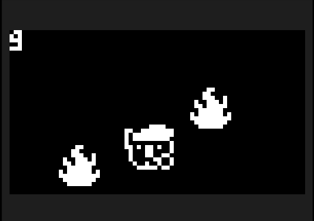

# Sleepy Koala

## 概要
`Sleepy Koala`は、Thumby向けに開発された縦スクロール型のアクションゲームです。プレイヤーはコアラのキャラクターを操作し、迫り来る炎から逃げながらゲームを進めます。キャラクターは十字キーの左右を押して移動できます。

## 特徴
- **ジャンル**: 縦スクロールアクションゲーム
- **操作方法**: 十字キーの左右でコアラを動かす
- **開発言語**: MicroPython

## インストール方法
このゲームをThumbyでプレイするには、以下の手順でソースコードをインストールしてください：
1. Thumby Code Editorを開きます。
2. ThumbyをPCにUSBで接続します。
3. 新しいファイルを作成し、このリポジトリのソースコードをコピー＆ペーストします。
4. ファイルを保存してThumbyに転送してください。

## ゲーム画面
ゲームのスクリーンショットは以下から確認できます：
  

## ライセンスとクレジット
- ライセンス: 特に指定はありません。
- クレジット: 記載はありません。

## 注意
このゲームはThumby専用です。動作させるにはThumbyデバイスが必要です。
